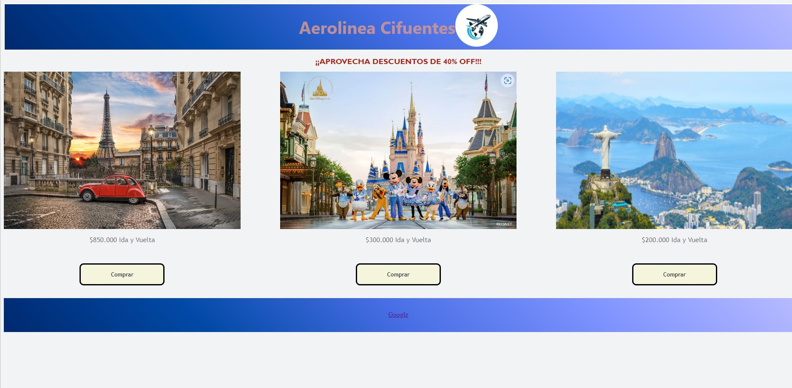
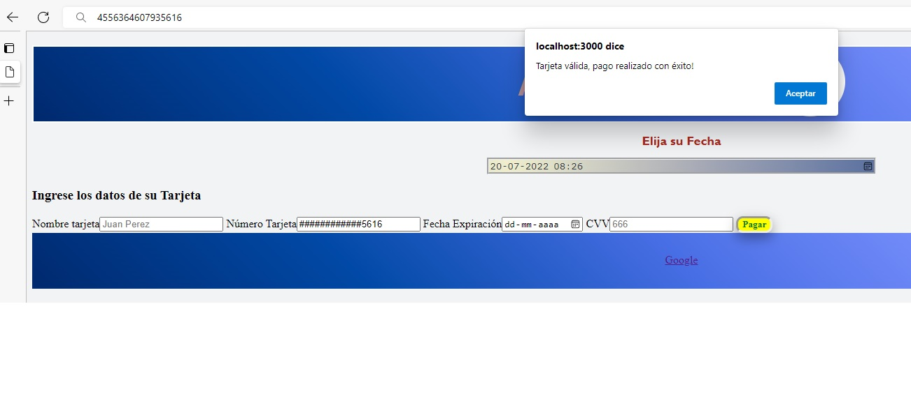

BIENVENIDO AL REPOSITORIO DEL PROYECTO MICHELLE Y ANDREA
card validation Aerolineas Cifuentes  🥰

Partimos con la idea de  hacer una pagina de viajes, en donde el cliente elija su destino y al elegir cualquiera de ellos lo lleve a comprar y el usuario deba ingresar una tarjeta de credito valida para que sea aprobada su compra.
Hicimos un prototipo a papel y lapiz de como queriamos que se viera la pagina:

Despues de eso empezamos a buscar imagenes que dera a nuestra pagina confianza al usuario
buscamos una color de background que pasara tranquilidad y confianza.
revisamos otras paginas de viaje y sacamos la idea de tener fecha de la viaje al tomar los datos de la tarjeta.
De esa manera creamos una pagina con una oportunidad real de validar una tarjeta
* Pagina principal

Entonces para ser amigable pensamos que debería después de recorrer las informaciones de la tarjeta tener un alert para la información al cliente que la tarjeta é valida o invalida.
*Pagina 1 Boton Comprar se despliega a proxima pagina

Pagina 2
hicimos formulario para recorrer los datos, com la opcion de elija su fecha de viaje.

Y despues se llena e se mascarar en formulario , debido la seguridad de la informacion no se puede copiar y pegar el numero de la tarjeta.

y Afinal tenemos un alert con la validacion de la Tarjeta Valida o invalida

TARJETA INVALIDA

TARJETA VALIDA

